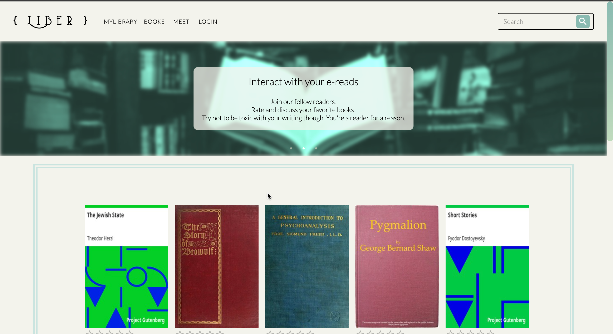
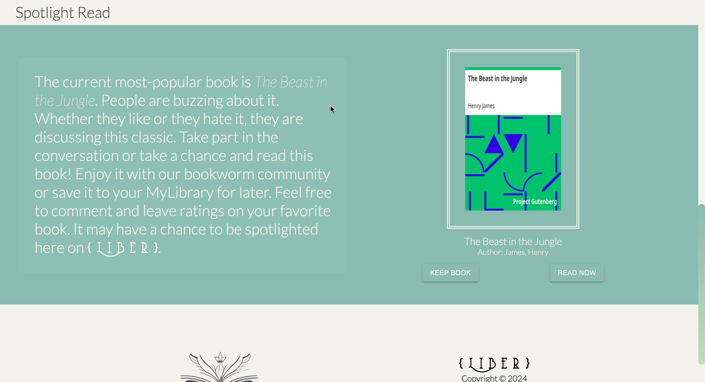
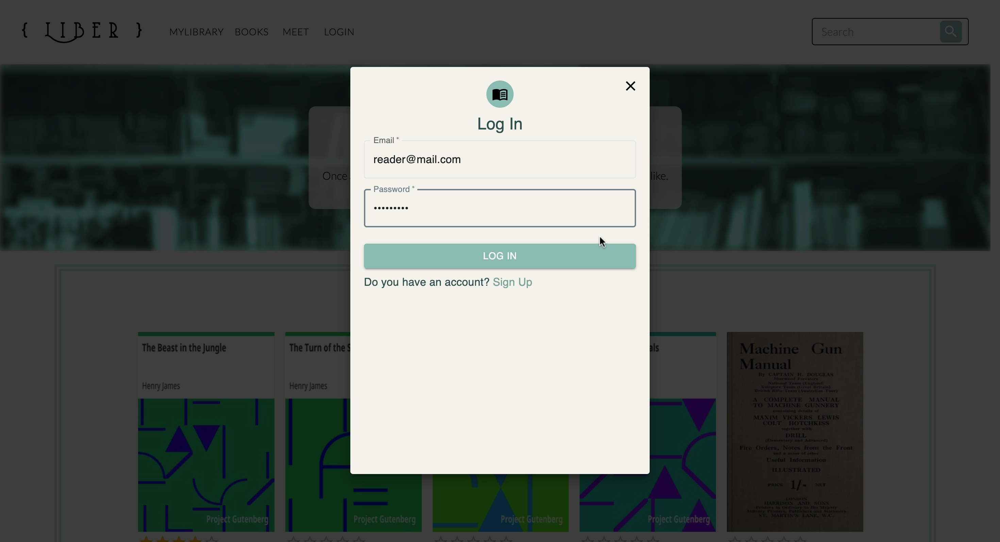
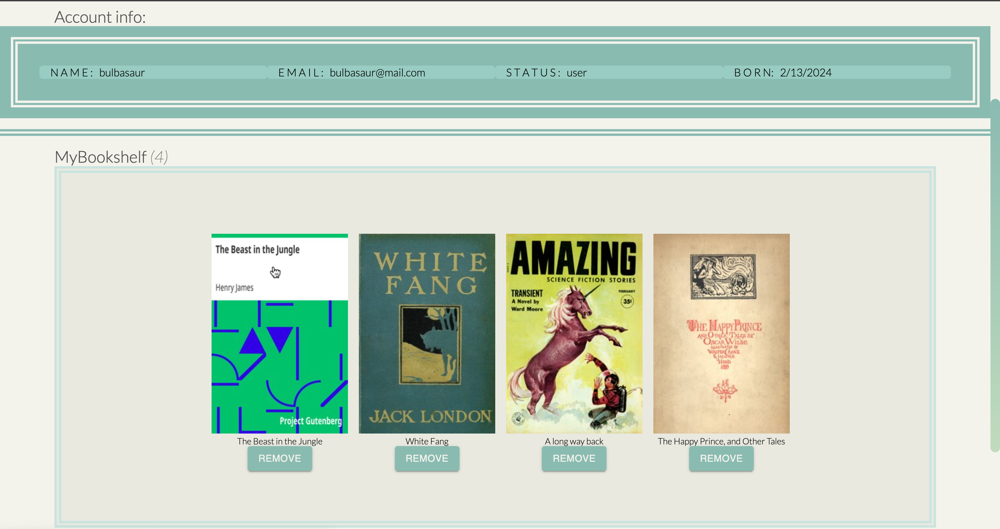
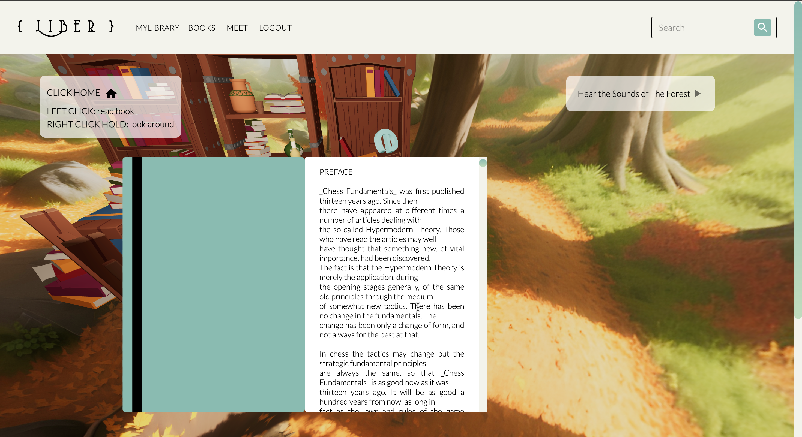
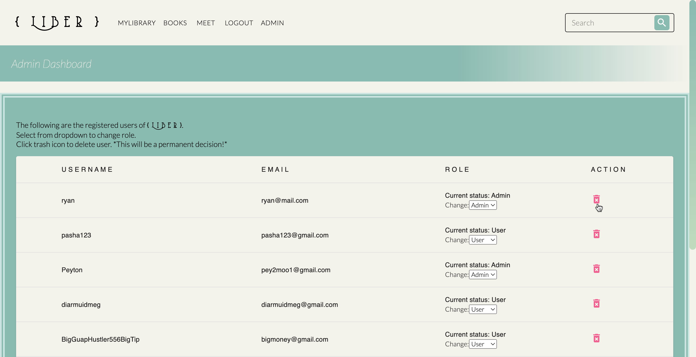
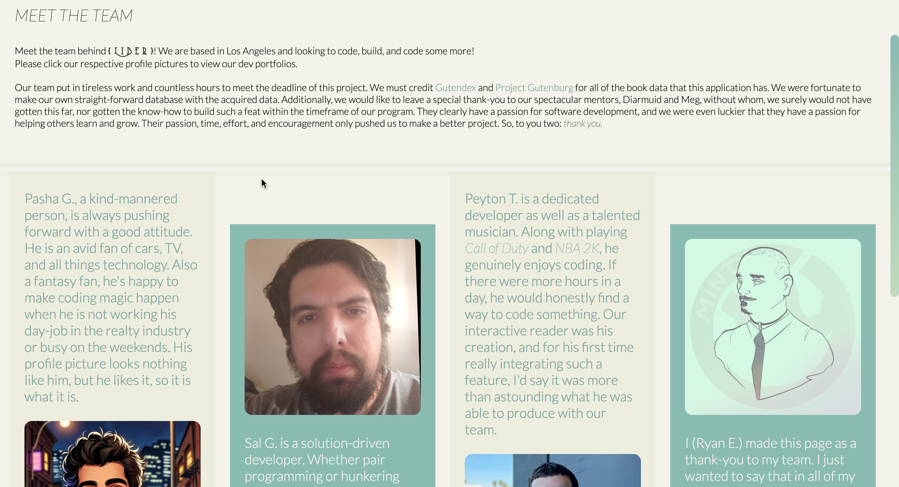

# Liber 3.0

## Description 📰

Liber is an interactive e-reader along with book-saving capabilities and a social media aspect -- think your Kindle, GoodReads, and saved-books-app combined. The motivation behind this app was to have a fun way to interact with your favorite reads and classic novels and to build upon our knowledge of graphql with React. We also used Blender in tandem with Threejs.

The app allows the user to search and view books, organized via our comprehensive search feature and a paginated system to help manage load times -- which was our biggest crux in learning throughout this project. We definitely kept in mind data size and load, but we also learned the hard way that testing in a development environment via localhost cannot prepare you for the real deal of a deployed server.

We learned to really use Threejs, we really learned and got the flow of graphql and how to build data from start to finish successfully. For some of us, it made us miss how easy it was to make a search bar in basic HTML and JS, whereas now, it took some critical thinking to make that magic happen.

But alas, throughout the ups and downs, we hope you enjoy the one word in Latin that means both "free" and "book": [Liber](https://liber-d603fbac9e96.herokuapp.com/).

NEW UPDATES: LIBER 3 NOW HAS CHATBOT INTEGRATION. IF YOU ARE LOOKING FOR A SPECIFIC BOOK OR HAVE ANY QUESTIONS FEEL FREE TO ASK LIBER AGENT ON THE BOTTOM RIGHT OF YOUR SCREEN.

[Please enjoy the deployed Liber!](https://liber-3-25f01cbf7764.herokuapp.com/)

## Table of Contents

&nbsp;&nbsp;&nbsp;&nbsp;&nbsp;&nbsp; ➣ [Installation](#Installation)

&nbsp;&nbsp;&nbsp;&nbsp;&nbsp;&nbsp; ➣ [Usage](#Usage)

&nbsp;&nbsp;&nbsp;&nbsp;&nbsp;&nbsp; ➣ [Contributing](#Contributing)

&nbsp;&nbsp;&nbsp;&nbsp;&nbsp;&nbsp; ➣ [Tests](#Tests)

&nbsp;&nbsp;&nbsp;&nbsp;&nbsp;&nbsp; ➣ [Credits](#Credits)

&nbsp;&nbsp;&nbsp;&nbsp;&nbsp;&nbsp; ➣ [Questions](#Questions)

## Installation 🔌

In order to install, please run `npm i`.

## Usage 🧮

In order to use this app, please run `npm start`.

From home, the user can navigate to use many features. Firstly, they are greeted with a slideshow, which describes Liber. Additionally, in the navigation bar, the user can view all books and search books. From there, home features all the books from our database, limited to 5 books per page. Under that hosts a Spotlight Read that features the most engaged-with book.

To take advantage of some of the following features, users must log in. If on mobile, they can navigate through our mobile nav menu in order to log in.

Upon viewing a single book, the user can comment on a book, rate a book, view other comments, keep book, or go ahead and instantly use our interactive e-reader.

When keeping a book, they are saved to your MyBookshelf in the user's MyLibrary page, where user can also see their account information.

Logged in or not, the main attraction of Liber is, of course, the interactive 3D reader! Have fun in there, and enjoy some easter eggs!

Those who are special and logged in are admins, and admins can do some unwieldly things...
(update users' roles or delete users)

And before you leave the app, feel free to meet the team behind this project!

## Contributing 🍴

In order to contribute, one must fork their repository and create a pull request.

## Tests ⚖️

In order to test, please run `N/A`.

 ## Credits 🤝
Thanks to D. Murphy & M. Meyers for mentoring us to this point!

  image carousel image 3: 
  [https://www.etsy.com/listing/1029661051/bookshelfs-mural-reading-room-wallpaper](https://www.etsy.com/listing/1029661051/bookshelfs-mural-reading-room-wallpaper)

  footer logo:
  [https://www.freepik.com/premium-ai-image/create-elegant-line-art-icon-book_83117203.htm](https://www.freepik.com/premium-ai-image/create-elegant-line-art-icon-book_83117203.htm)

## Questions 📭

Please enjoy our work at our respective GitHubs!
- @[pToum21](https://github.com/pToum21)
- @[SalGonzalez151](https://github.com/SalGonzalez151)
- @[pashag123](https://github.com/pashag123)

For any additional inquiries, please message any one of us.
